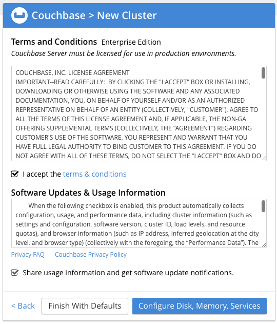
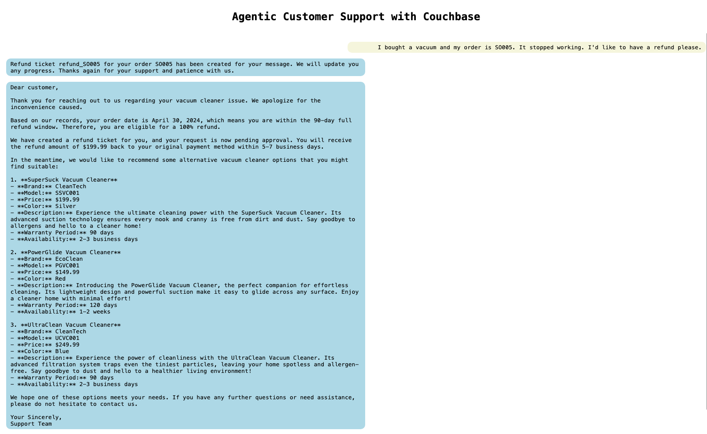
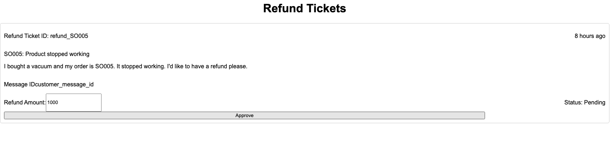
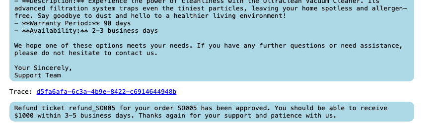
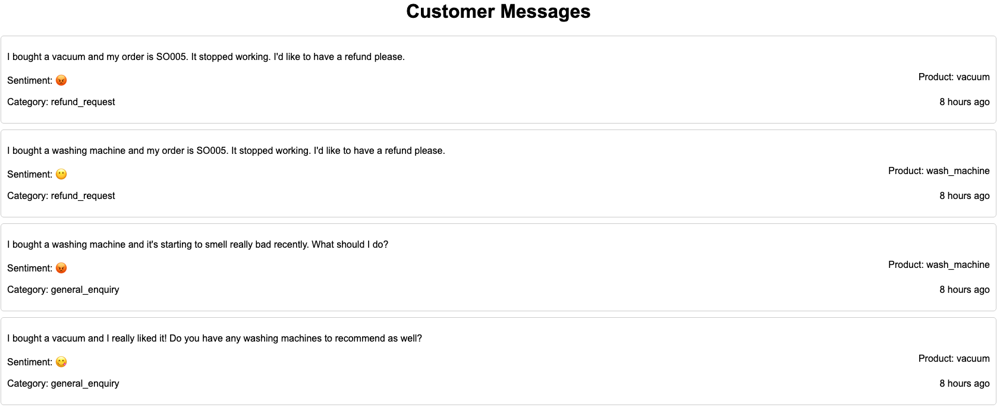
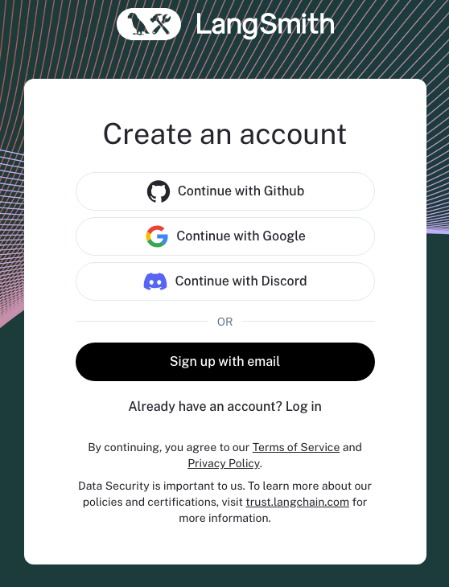
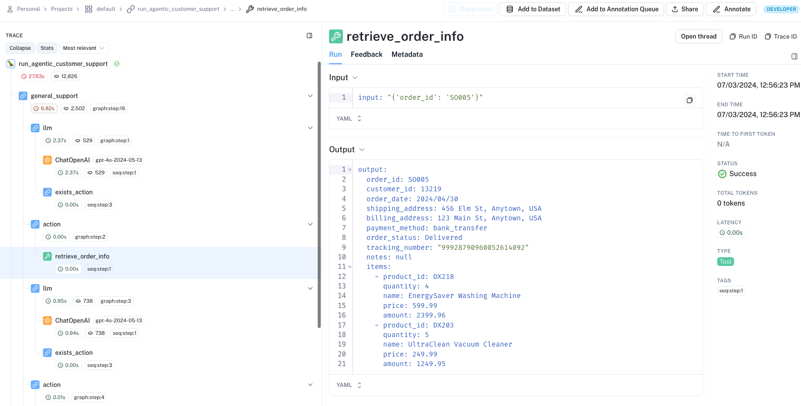

# Agentic Customer Service with Couchbase and LangGraph

Is GenAI utility limited to advanced question answering using RAG? 

Absolutely not. Agentic LLM provides a robust framework to define functions, tools, and give them to LLM so they learn to reason, orchestrate and execute complex workflows without needing human supervision. Pretty much like giving an assistant a well-written Job Description, and leave them to their job.

A predominant use case across industries is customer service - we all need to provide timely, quality, and scalable customer feedbacks, to achieve high customer satisfaction while optimizing business interest, regardless of what we do. 

That’s what we’re building in this demo. When a customer message is received, whoever in charge of handling the ticket would need to perform a series of tasks, including looking up the order and products mentioned, reading product manual, checking company policies... the list goes on, and in any combination or sequences, until it’s deduced that the job is reasonably finished, and finally a reply is sent out. Why not let AI figure out the logics and do it?!

Meanwhile, customer support may well extend beyond question-answering pattern. We’ll also see agentic LLM create tickets, notifications being sent out, data being updated in real-time, and how Couchbase Eventing stitches them together. 

At a high level, this is what happens: 


<br>


## What Do I Need to Run This Demo? 
1. an OPENAI api key 

2. a LangSmith key for traceability

3. 1 linux virtual machine for hosting the app, and another for installing Couchbase. I'll use AWS EC2 but anything with minimal config will do

<br>

> 🙌🏻 We're using [LangChain](https://www.langchain.com/) and installing [Couchbase Server Enterprise Edition 7.6](
https://www.couchbase.com). Knowledge of these 2 tools are a plus but not a prerequisite. 

<br><br>


## Setup

**1.1 LLM & LangSmith**
<br>

GPT-4o is used in this demo. You need to have an **OPENAI_API_KEY** from [OpenAI](https://openai.com/). 

[LangSmith](https://smith.langchain.com/) is the observability stack for LangChain, and is used for traceability, a crucial component that makes it ever simplier to understand, troubleshoot, and optimize the LLM workflow. We'll also get a **LangChain_API_KEY**.  


<br><br>

**1.2 VM Deployment**
<br>

We will need 2 instances, one to host the app (**the App Node**), and the other for running Couchbase as the backend (**the Couchbase Node**). Follow either 1.2.1 for Terraform setup, or set up manually from any linux-based VM instance from 1.2.2. 


>🙌🏻 Run either 1.2.1 or 1.2.2 below for nodes creation.

<br><br>

**1.2.1 Using Terraform** 
<br>

If you’re a Terraform user, download the /terraform folders from the root directory of this Github repo. 

Create a variable file **terraform.template.tfvars** with necessary cloud credentials. I'm using AWS and this is the variables I needed. If you're on another cloud, follow [Terraform documentation](https://registry.terraform.io/) for proper setup.

```
access_key = 
secret_key = 
```

<br>

Finish the set up of server.tf and run the script. Upon successful node creation you should see these 2 hostnames as output. Note them down. 


<br><br>

**1.2.2 Using AWS Console** 
<br>

Create a the **App Node** with the following startup script: 
```
#!/bin/bash
sudo yum update -y
sudo yum install git -y
sudo yum install python3 -y
sudo yum install python3-pip -y
git clone https://github.com/sillyjason/agentic_customer_service_with_couchbase
cd agentic_customer_service_with_couchbase
python3 -m venv venv
source venv/bin/activate
pip install -r requirements.txt
```
<br>


Create a the **Couchbase Node** with the following startup script: 
```
#!/bin/bash
sudo wget https://packages.couchbase.com/releases/7.6.1/couchbase-server-enterprise-7.6.1-linux.x86_64.rpm
yes | sudo yum install ./couchbase-server*.rpm
sudo systemctl start couchbase-server
```
<br>

>🙌🏻 Make sure to update Security Group setting to allow ALL inbound/outbound traffics.

<br>

By now both App Node and Couchbase Node are successfully created. Let's continue.  

<br><br>

**1.3 Couchbase Node Setup**
<br>

Grab the hostname of Couchbase Node and let's create the backend. Access the Couchbase service via this link: 

```
{couchbase_node_dns:8091}
```

You'll be greeted with the screen below. 


<br><br>

Let's setup a new cluster. Note down the **Username** and **Password**


<br><br>

Accept the terms and click "**Configure Disk, Memory, Services**" since we don't need all Couchbase services in this demo. 



<br><br>

Unselect "Analytics" and "Backup". Leave the rest unchanged and click "**Save & Finish**"


<br><br>

All good! You'll see the empty-ish screen below since we haven't created the data structure or ingested data, which will be via scripted. Now let's proceed with the App Node.


<br>

>🙌🏻 In a production set up you'll need at least 3 nodes to run Couchbase for HA purposes. In our case, let's just use 1 node for simplicity.


<br><br>

**1.4 App Node Setup**

<br>

SSH into your App Node, cd into the project directory, activate python virtual environment, and edit the **.env** file: 
```
sudo -i
cd /
cd agentic_customer_service_with_couchbase
source venv/bin/activate
nano .env
```

<br>

.env file: 

```
# LLM Keys
OPENAI_API_KEY={openai_api_key}

# EE Environment Variables 
EE_HOSTNAME={Couchbase_node_hostname}
EVENTING_HOSTNAME={Couchbase_node_hostname}
SEARCH_HOSTNAME={Couchbase_node_hostname}

#Couchbase User Credential
CB_USERNAME={username_created}
CB_PASSWORD={password_created}

# App Node
APP_NODE_HOSTNAME={App_node_hostname}

#LangSmith
LANGCHAIN_TRACING_V2=true
LANGCHAIN_API_KEY={langchain_api_key}
```

<br><br>

Update the Eventing functions endpoints with the hostname of App Node. 

```
python3 updateips.py
```

>🙌🏻 - Eventing is Couchbase's version of Database Trigger and Lambda functions. It's a versatile and powerful tool to stitch together your data processes and achieve high automation.


<br><br>

Set up bucket/scope/collections, fts index, and update the endpoint for the app: 

```
python3 setupservers.py
```

<br>

> ❗️Sometimes the event creation might fail and you would see error message like below:
```
Error importing function process_refund_ticket: 400 Client Error: Bad Request for url:xxxx. 
```

<br>

This could be due to not enough time between bucket and eventing creation. In this case, re-run the command and you'll see the success message: 
```
Importing function process_refund_ticket...
Function process_refund_ticket imported successfully
Importing function process_message... 
Function process_message imported successfully
```

<br><br>

Now let's load some sample data. This includes products, orders, product FAQ, and refund policies. We will see the bot reasoning through the query and interact with the data in the ways deemed fit.

```
python3 reindex.py
```

<br><br>

You should be able to see this success message.


<br><br>

You can also check the Couchbase console. There should be data in "**orders**", "**products**" and "**policies**" collections under **"main"."data"** keyspace.


<br><br>

As a last step, let's create some indexes needed for the bot to run queries later. Go to Couchbase console, select **Query** from the left side menu bar, and run the syntaxes below **individually**: 

```
create primary index on `main`.`data`.`policies`
create primary index on `main`.`data`.`products`
create primary index on `main`.`data`.`orders`
create primary index on `main`.`data`.`messages`
create primary index on `main`.`data`.`message_responses`
create primary index on `main`.`data`.`refund_tickets`
```

<br><br>

>🙌🏻 We're creating primary indexes here which only index the document keys, and this is not a recommended indexing behavior in production environment, where more performant and advanced indexing should be employed instead.

<br><br>

All good. Let's go 

```
python3 app.py
```


<br><br>

## Chat with the Bot 

<br>

On your browser, access this link below. You should see the empty chat screen.

> {App_node_hostname}:5001


<br><br>

**Ask Product Questions**

<br>

Let's ask some **product related** questions: 

```
I bought a vacuum and I really liked it! Do you have any washing machines to recommend as well?
```


Under the hood the bot is sending **SQL queries** to Couchbase to fetch washing machine product info. 

<br><br><br>

Let's ask questions that's trickier than SQL query. Refresh the page, and ask another question.

```
I bought a washing machine and it's starting to smell really bad recently. What should I do? 
```

<br>


<br><br>

Other than recommending some products, it's actually looking into the product manuals. Semantic Search and RAG is in play here supported by Couchbase Vector Search. 

<br><br><br>

Let's refresh the page again, and try asking some refund queries: 

```
I bought a washing machine and my order is SO005. It stopped working. I'd like to have a refund please.
```


<br><br><br>

The bot is able to deflect invalid refund requests by looking into refund policy, doing some maths and making a sound judgement calls. Now what happens if the refund request is valid? 

```
I bought a vacuum and my order is SO005. It stopped working. I'd like to have a refund please.
```

<br>



<br><br>

This time the refund request is deemed valid since washing machine and vacuum have different refund period (you can check under **dataset/faq.txt**, which is indexed into Couchbase). Note the bot even created a refund ticket, which can be found under "main"."data"."refund_tickets" collection in Couchbase.


<br><br>


## Beyond the Question Answering

Realistically, the customer service process doesn't end with the initial response provided. A common example is follow-ups on the refund ticket. Let's put on the hat of a Refund Manager and look at the valid requests created by the bot. Access the Refund_Tickets page via: 

> {App_node_hostname}:5001/tickets 

<br>



Logically, the refund admin looks at the information here, checks out details of everything, and makes a sound judgement on whether the bot-deemed-qualified refund is indeed valid, and the refund amount.

Of course another LLM agent can be set up for this task too, but let’s agree on this: in 2024, it’s still a good call to involve human beings in such decision makings. Let’s approve this refund ticket.

You’ll see a success message. Refresh the page. The update is reflected.

Go back to main page. Another message is sent to the customer on the good news of the refund ticket. Again, [Couchbase Eventing](https://www.couchbase.com/products/eventing/) doing its real time process stitching. 




<br><br>

Let’s go to “Customer Message” tab. 

> {App_node_hostname}:5001/messages 

<br>




Note each message has been labelled a sentiment, and a category. We’re leveraging LLM to apply metadata here, but again, Eventing is making this automation smooth as butter.

<br><br>

## Traceability 

We all know LLM cannot be fully deterministic at the moment. That is why, if we entrust the reasoning process to a bot, we need to have full visibility on its reasoning process. 

Note how every response from the bot has a "trace" link provided. Let's click the link, which will take us to the LangSmith page where this reasoning process is broken down to details.

<br>


<br><br>

With first-time access, you'll be prompted to login. Use the same credentials for which you created the LangChain API key. 



<br><br>

You should be able to see something like this:


LangSmith is an awesome tool for understanding and troubleshooting the agentic process. Note in our workflow, we have define 5 agents: 

- General-support agent that gathers info of order and products mentioned, and generate an initial response 
- Recommendation agent that searches and recommends products
- Product_fix agent that searches the FAQ library for any product-related queries 
- Refund agent that reasons through whether refund requests, if raised, is valid 
- And a Finalizer agent that takes all info gathered previously, and generate a professional and relevant response based on customer query. 


<br><br>

Drill into any step during the reasoning chain, look at the input/output. I find it amazing at even optimizing my workflows!



